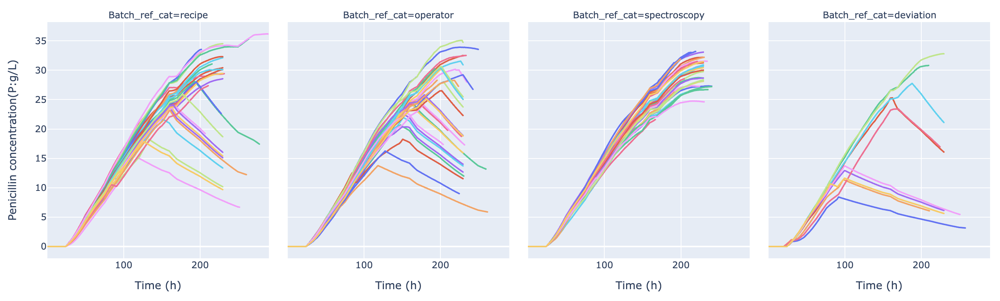

## Utilizing Autoencoders for Anomaly Detection in Time Series Data

###Project description:

Using data from [Kaggle](https://www.kaggle.com/datasets/stephengoldie/big-databiopharmaceutical-manufacturing)'s, "Big Data Biopharmaceutical Manufacturing" dataset, I developed an anomaly detection model specifically designed for fermentation processes. Fermentation data is characterized by being a time series, exhibiting specific trends that may include occasional spikes, which are considered normal behavior during a successful run. However, many automated tools often flag these spikes as errors, leading to false alarms.

To address this issue, I adopted an approach that leverages the availability of training data for "good" runs. I constructed an autoencoder, a type of neural network, where the objective was to reconstruct the original trend from the data. By comparing the reconstructed trend to the actual trend, any discrepancies or differences were identified and quantified as errors. By accumulating enough training runs, it became possible to establish a mean or average behavior for the population. Consequently, we could determine which runs deviated significantly from the expected norm, thus identifying statistically significant outliers.

This anomaly detection model offers an effective solution for identifying anomalies in fermentation processes, enabling better decision-making and reducing false alarms caused by normal variations in the data.

 <!-- I created an anomaly detection model that allows for fermentation process. Because fermentation data is a time series, with specific trends having "spikes" as part of a good run, a lot automated tooling will detect errors, when they are actually normal behaviors. The apporach i took was that since there is training data for "good" runs, we will build an autoencoder, whrre the reconstruction will be compared to the original trend. Any difference between actual and predicted will be summarized as error. Thus with enough runs, we can determine a mean for the population and see which runs are statistically an outlier. -->

### Exploratory Data Analysis:

Control logic during fermentation is difficult to discern when a run is deviating vs being controlled correctly so build a model that can be fit to understand the normal trends vs deviations. 

After downloading the data we begin some exploratory data analysis 

One thing, that is common with fermentation data is there is similar but variable length of time for each run or the the length of time points is variable. We will not want to train with any outlier time series data and first we will look at the shape of each run.


As we see there is some variability in the length of runs, we will ensure that anything that is not within 2 standard deviations of the mean will be removed from the potential pool of training data as this method will rely on the training runs being labeled as "good" runs.

Additionally, we will look at the distribution of the data for each column. The min/max values and ensure visually that the data is not skewed, or seems problematic.

Utilizing a quick ipywidget we can identify trends with each label an ensure that each group appears similar.

```python
import ipywidgets as widgets
 
variable_plot_selection = widgets.Dropdown(options=variable_list, value = 'Penicillin concentration(P:g/L)')
variable_plot_selection
```
For the purposes of this write up we will only show Penicillin, as this is the target molecule and will be the most evident that a deviation was present in the data. 



As is evident in the plots above, the recipe, and operator have runs with lower performance that dont not follow the average trend. Given the large number of runs, and the need to seperate runs into "good" we will use an unsupervised learning approach to see if what clusters are present in the time series.

### Labeling Runs:
Refer to this post to go into a deeper dive of clustering time series trends [link](/time_series_clustering). We will select a k of 4 given the listed conditions in the dataset, the scree plot suggests 2 clusters is suffcient but it only seperates one gross outlier. As we see in the image there is good seperation even though they are clusters 0,1,2 are very close to each other.


After running throught the code we see that there is x number of ideal clusters.

After dynamic time warping K-means clustering, we see that there are 4 clusters that are ideal for the data. With cluster representing the most ideal trend, and the remaining clusters representing the other trends, with reduced performance of penicillin production.


### Building an AutoEncoder:
Autoencoders are a type of neural network that are used to learn efficient data codings in an unsupervised manner. The aim of an autoencoder is to learn a representation (encoding) for a set of data, typically for dimensionality reduction, by training the network to ignore signal “noise”. Along with the reduction side, a reconstructing side is learnt, where the autoencoder tries to generate from the reduced encoding a representation as close as possible to its original input, hence its name.

Now that we have labeled data, we will consider all runs in cluster 2 to be performant and what we want to train the model on. The reason is that while there is useful data in the other clustered runs, we want to train the model on the most ideal runs, as including anaomalous runs in the encoder will allow the model to recreate incorrect trends. If an end client identified other runs to be of interest or considered normal we would add those into the model But for the purposes of this write up we will only consider the most ideal runs, or "Golden" runs.

An example of an autoencoder 


[Source](https://www.compthree.com/blog/autoencoder/)


#### Data Prep for Model:

First we will build a series of functions to enable easy data prep for the model.

These involve getting the maximum size of the dataset, this way we can ensure equal lengths for the model to ouput.
Once the size is determined we will pad the data with 0's to ensure that the model can learn the trends. The choice of 0's is because if a run is terminated the probes etc would no longer be reading data and would be 0.
The model for demonstration will be a single variable model **Dissolved oxygen concentration(DO2:mg/L)**. This is because the model will be able to learn the trends of a single variable and we can see how the model performs. The model can be expanded to include all variables, but for the purposes of this write up we will only consider a single variable.

 

Following this initial data prep we will also need to prepare the data for the model. We will need to normalize the data. We will also need to ensure that the data is in a format that the model can understand. We will need to reshape the data to be in a 3D format, where the first dimension is the number of samples, the second dimension is the number of time steps, and the third dimension is the number of features. 

With the transformed data we will now fit the model. The encoder and decoder will be the same shapes, and the model will be a sequential model. The model will be trained on the "Golden" runs, and then we will test the model on the other runs to see how the model performs.

In order to determine an "outlier" run, we will plot the error of model on the training data. After we observethe distrubiiton of the loss function we can determine a threshold value for the loss function. This will be the value that we will use to determine if a run is an outlier or not, and account for the noise in the training data.

 
As we see above the boxplot for the we consider runs above the red line 3 standard deviations above the mean to be outliers. This is a conservative approach, and we could adjust this to be more or less conservative depending on the needs of the client.

### Results:


After trainign the model, we will look at examples of the model performance and demonstarte the the value in visualizing the error. 


As we see and have calculated the error is 0.02, which is within 3 standard deviations of the mean. This is a good run and the model is able to predict the trend well.

Next we will observe a run that is not ideal, and see how the model performs.


With this run, there is a MAE score 1, and thus is an anomalous and can be considered an outlier. Which a subject matter expert would be able to also identify as an outlier, so now the end user can decide to investigate the run, with the visualiation of the error to help them make a decision as to if the anomaly is worth investigating, or a run to be ignored.

### Conclusion:

Autoencoders, work well with complex time series, and provide interpretable and useful outputs for scientists to explore potential reasons a fermentation run was anomalous.

Additionally, the model itself was realitviely fast to train thus providing the Data Scientist with easy to optmize models and thus deployment and future api calls against the model can be fast and efficient.

The downsides of this model so far appear to be the specificty of the model to "golden" runs. Where a client would need to provide a set of labeled runs where this model would be able to learn the trends. Additionally, one of the best use cases of a model like this is in a manfuacturing or scale up space where the process is consitent. In a process development environment, there are applications where scientists can observe the differences between process changes and there effects on online trends but given limited tank capcity it could be a potential issue of building a model for every process change.

However, the model is able to provide a useful tool for scientists to explore the data and provide a useful tool for the end user to explore the data and make decisions on how to proceed with the data. Additionally, if the model is deployed in a production environment, the model can be used to flag anomalous runs and provide a useful tool for the end user to explore the data and make decisions on how to proceed with the data.


<!-- 

```javascript
if (isAwesome){
  return true
}
```

### 2. Assess assumptions on which statistical inference will be based

```javascript
if (isAwesome){
  return true
}
```

### 3. Support the selection of appropriate statistical tools and techniques


### 4. Provide a basis for further data collection through surveys or experiments

Sed ut perspiciatis unde omnis iste natus error sit voluptatem accusantium doloremque laudantium, totam rem aperiam, eaque ipsa quae ab illo inventore veritatis et quasi architecto beatae vitae dicta sunt explicabo. 

For more details see [GitHub Flavored Markdown](https://guides.github.com/features/mastering-markdown/). -->
